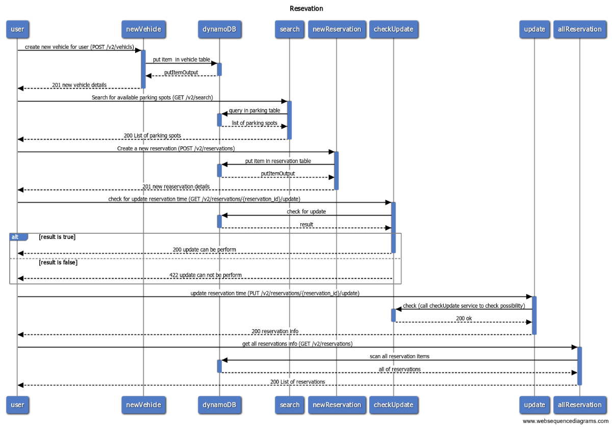

# Spot Hero Project

## API
> deploy api url =>  https://rxzgqi6zfc.execute-api.us-west-2.amazonaws.com/api/

>click [here]( https://rxzgqi6zfc.execute-api.us-west-2.amazonaws.com/api/v2/swagger/index.html) to see swagger UI

## Folder structure of project

- **controller**: There are controller of router, and their integration tests in this file.
- **docs**: There are swagger files in this folder.
- **lib**: There are some function which use in whole of project such as connect to dynamodb function, error handling, response function. 
- **mocks**: There are mock interface of dependency for unit tests, that created by mockery.
- **models**: This package contains of whole models that use in project.
- **routes**: There are functions that create router is their duty.
- **services**: There are services that use them in controller, and their unit tests.
- **main.go**: There is lambda handler  in this file.
- **serverless.yml**: this file contains of configuration serverless framework that use in GitHub action for deploy project in AWS.

## environment variable
>This environment variable must be set in lambda configuration
- **ACCESS_TOKEN** : Access_token_id for access to aws service
- **SECRET_KEY** : Secret_key_access for access to aws service

:pushpin: The request and response that aws pass to lambda is different with the request and response that gorilla mux work with them. so
we need convert aws req to golang req and use it in gorilla mux router, the end covert golang res to aws res. for this purpose
we use [`awslabs`](https://github.com/awslabs/aws-lambda-go-api-proxy) package.

## project scenario

- Create a new user vehicle
- Search for available parking spots at a specific facility
- Create a new reservation for parking at the same facility (for the current user)
- Check if a reservation time can be updated
- [Assuming success from the previous check] Update a given reservation to extend end time for the reserved parking spot
- Get the summary of all reservations (for the current user)

In this project there are a bunch of facility which already add to database and user can create some vehicle for itself then he can reserve each of facility for his vehicle.
there is the endpoint for search this facility. if longitude and latitude exist in query  this endpoint returns facility that is with same lon and lat otherwise return all facility.
In create reservation endpoint and update reservation endpoint should send reservation info and vehicle id and facility id then controller fetch facility  and vehicle info according to it id and put in dynamodb table.

## sequence diagram

## models
In this project have used some models:
### vehicle
This is model of user vehicle in project that have some field:
- vehicle_id: String
- description: Object(description model)
### description
This is model of description for vehicle that have som field:
- name: String
- model: String
- year: String
### facility
This is model of facility in project that have some field:
- facility_id: String
- city: String
- country: String
- latitude: Float64
- longitude: Float64
### Reservation
This is model of reservation in project that have some field:
- reservation_id: String
- parked_vehicle: Object(vehicle model)
- facility: Object(facility model)
- quote: Object (quote model)
- update_possible
### quote
This is model of quote for reservation that have som field:
- starts: String
- ends: String
### inputReservation
This model is look like reservation model but id of vehicle and reservation put in this model instead of complete model.This model has used for body of create reservation endpoint and update reservation endpoint
## Test

:pushpin: For controller, integration tests applied, and items that created in integration test delete at the end of test.

:pushpin: For services, unit tests applied, first we mock that dependency which use in service, and we isolated this service

## serverless
In serverless.yml file set config for apigetwaye and dynamoDB table and lambda function.github action was set to automated test, build and deploy to aws,too 

## makefile
In makefile set some stage for run test, build and deploy project in aws 
